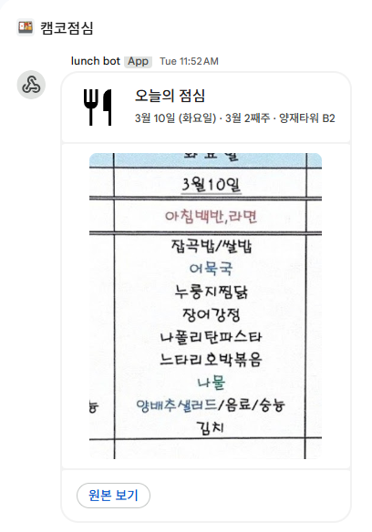

# 🍚 lunch-bot

양재타워 B2 구내식당 점심 메뉴를 매일 Google Chat으로 자동 발송하는 봇입니다.

서버 없이 GitHub Actions만으로 동작합니다.



## 동작 방식

```
월요일 10:00 KST
  네이버 지도 피드에서 주간 식단표 이미지 크롤링 (Selenium)
  → menu_info.json에 저장 후 자동 커밋

평일 11:00 KST
  식단표 이미지 다운로드
  → 오늘 요일 컬럼만 크롭 (Pillow)
  → ImgBB에 업로드
  → Google Chat 웹훅으로 카드 메시지 발송
```

주말 및 공휴일은 자동으로 스킵됩니다.

## 기술 스택

| 구분 | 사용 기술 |
|------|-----------|
| 런타임 | GitHub Actions (서버리스) |
| 크롤링 | Selenium + Chrome Headless |
| 이미지 처리 | Pillow (요일별 컬럼 크롭) |
| 이미지 호스팅 | ImgBB API |
| 메시징 | Google Chat Webhook (Cards V2) |

## 구조

```
lunch-bot/
├── .github/workflows/
│   ├── update-menu.yml    # 월요일: 주간 식단표 크롤링
│   └── send-gchat.yml     # 평일: 오늘 메뉴 발송
├── update_menu.py          # 네이버 지도 → 식단표 이미지 URL 추출
├── send_gchat.py           # 크롭 → 업로드 → Google Chat 발송
├── config.py               # 환경변수, 공휴일 설정
├── menu_info.json          # 크롤링 결과 (Actions가 자동 업데이트)
└── requirements.txt
```

## 배경

점심 시간에 매번 식단표를 찾아보는 게 번거로워서, 팀 채팅방에 자동으로 오늘 메뉴를 공유하는 봇을 만들었습니다.
